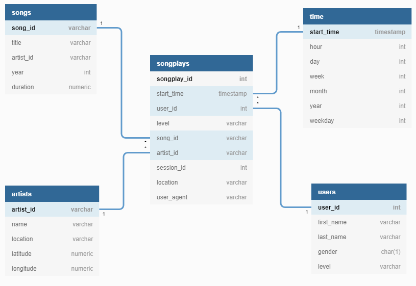

# Data Lake with Amazon S3 and EMR

## Introduction
A startup called Sparkify wants to analyze the data they've been collecting on songs and user activity on their new music streaming app. Their user base and song database have grown large and want to move their data warehouse to a data lake.

## Project Description

The goal of this project is to develop a data lake and ETL process for song play analysis.

Their data resides in S3, in a directory of JSON logs on user activity on the app, as well as a directory with JSON metadata on the songs in their app. ETL pipeline has to be built that extracts data from S3, processes them using Spark, and loads the data back into S3 as a set of dimensional tables in parquet files. This will allow their analytics team to continue finding insights in what songs their users are listening to.

ETL pipelines that transfers data from files in json format to Amazon S3 are to be developed using python and deploy on a cluster built using Amazon EMR.

## Datasets

Data is available in two separate folders in s3 under log_data and song_data folders.

### Log Data
The log_data folder consists of activity logs in json format. The log files are partioned by year and month.

 - log_data/2018/11/2018-11-12-events.json
 - log_data/2018/11/2018-11-13-events.json

Sample data:

    {"artist":null,"auth":"Logged In","firstName":"Walter","gender":"M","itemInSession":0,"lastName":"Frye","length":null,"level":"free","location":"San Francisco-Oakland-Hayward, CA","method":"GET","page":"Home","registration":1540919166796.0,"sessionId":38,"song":null,"status":200,"ts":1541105830796,"userAgent":"\"Mozilla\/5.0 (Macintosh; Intel Mac OS X 10_9_4) AppleWebKit\/537.36 (KHTML, like Gecko) Chrome\/36.0.1985.143 Safari\/537.36\"","userId":"39"}

### Song Data
Each file in song_data folder contains metadata about a song and the artist of the song. The files are partitioned by first three letters of each song's track ID

- song_data/A/B/C/TRABCEI128F424C983.json
- song_data/A/A/B/TRAABJL12903CDCF1A.json

Sample Data 

    {"num_songs": 1, "artist_id": "ARD7TVE1187B99BFB1", "artist_latitude": null, "artist_longitude": null, "artist_location": "California - LA", "artist_name": "Casual", "song_id": "SOMZWCG12A8C13C480", "title": "I Didn't Mean To", "duration": 218.93179, "year": 0}
 
## Schema for Song Play Analysis

 The schema design used for this project is star schema with one fact table and four dimension tables
 
 Star Schema is suitable for this analysis because:
 - The data will de normalized and it helps in faster reads
 - Queries will be simpler and better performing as there are lesser joins
 - We don't have any many to many relationships



### Fact Table
**songplays** -  Records log data associated with song plays (records with page NextSong). songplays table files are partitioned by year and month and stored in songplays folder

### Dimension Tables
**users** - users in the app (user_id, first_name, last_name, gender, level). users table files are stored in users folder

**songs** - songs in music database (song_id, title, artist_id, year, duration). songplays table files are partitioned by year and then artist, stored in songs folder

**artists** - artists in music database (artist_id, name, location, latitude, longitude). artists table files are stored in artists folder

**time** - timestamps of records in songplays broken down into specific units (start_time, hour, day, week, month, year, weekday). time table files are partitioned by year and month and stored in time folder

 
## Files
+ ```etl.py```: main pyspark script to do the ETL.
Please see the readme inside for more information.
+ ```data/*```: data used for local testing.
+ ```dakelake.ipynb``` : Development notebook. Use for step by step explorarion.
+ ```dl.cfg```: file that can hold AWS credentials. Notice that I prefered to call
my credentials from my root folder instead.
+ ```experiments_spark.ipynb``` pyspark dataframe explorarion.
+ ```output_parquet_files/*```: stored parquet files after local testing execution.

## Usage
+ There are two modes of operation. local (local_test) or cloud(aws)
    + **local_test** will use ```data/*``` files to make an ETL locally and store the
        tables in ```output_parquet_files/*```
    + To run type in terminal```python ./etl.py --mode local_test```
    + **aws** will use s3 urls to read udacity bucket and then will write the result
    into a the s3 bucket specified in the main function of ```etl.py```.
    + To run, SSH to EMR instance, copy ```etl.py``` and  ```dl.cfg```
     execute the script ```/usr/bin/spark-submit --master yarn ./etl.py ```
    
